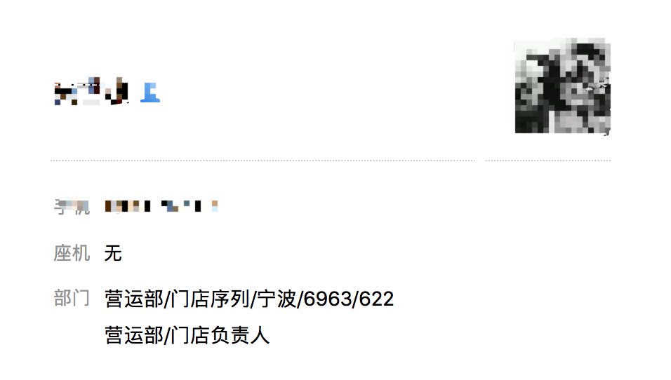
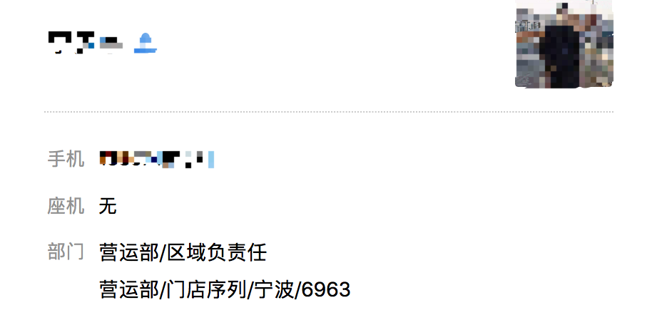

### 为什么会没有后台管理权限

我土哦后台管理权限是和企业微信的通讯录绑定的,要拥有后台的管理权限
1. 首先确认你加入了企业微信,并且公司为M6生鲜
1. 确认加入公司之后你要确认自己的部门信息是否正确
2. 目前后台的管理权限分为管理员和门店长两类
>  门店店长首先需要在【门店负责人部门】,  
其次还需要在【对应的门店部门】.  
比如你需要600店的店长权限,你就需要在【门店负责人部门】和【600店部门】  

#### 图片示例:

> 管理员需要归属于区域  

#### 图片示例:

### 没有权限怎么办
1. 没有加入公司: 
  请联系蔡莉莉或者其他人员将你邀请到公司内

1. 没有相关部门权限的,
  >  请在工作台->审批,发起门店负责人调换,  
    审批通过之后由蔡莉莉或者人事部门调换部门,  
    凌晨五点我土哦权限会刷新一遍  
    权限刷新之后就可以管理后台了