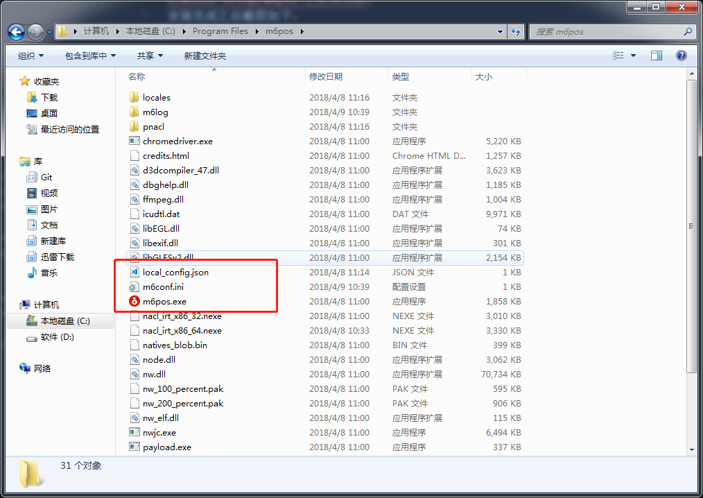
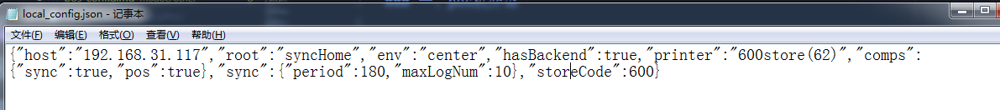

## M6生鲜pos机-配置文档

### 一、pos机介绍

新版ps系统可以用安装包形式安装，[1.0.6版本下载链接](http://shake.m6fresh.com/m6pos/releases/1.0.6/win32-setup/m6pos-1.0.6.exe)
安装完成之后截图如下：

> 1. **m6pos.exe** 为收银主程序，打开后会会读取local_config.json配置文件，如果后台未开启，会自动打开后台程序 **run.exe**  
> 1. **local_config.json** 主程序配置文件，具体配置说明见附录1
> 2. **run.exe** 后台程序，会自动开启，也可以手动开启
> 3. **m6config.ini** 后台程序的配置项，没有这个文件的情况可以双击打开**run.exe**,会自动生成的

#### 附录1 local_config.json介绍

字段名|字段意义|默认值|可选其他值
---|---|---|---
host|后台程序地址|localhost，表示本地后台，只有不启用本地后台的时候修改成其他开启后台电脑的ip地址，修改后程序将不会自动开启本地后台，一般不要改|其他电脑ip地址
root|程序打开之后的首页|syncHome，同步系统|posHome，收银主页
env|程序运行环境|store，门店环境，一般不要改|cneter，中心环境
printer|默认打印机的名称|600store(62)|无
storeCode|门店编号|606|其他门店编号
comps|功能列表，具体见下表|无|无
sync|同步系统配置项，具体见同步系统配置表|无|无

- comps配置表

字段名|字段意义|默认值|可选其他值
---|---|---|---
sync|是否开启同步功能|true，开启|false，关闭
pos|是否开启收银功能|true，开启|false，关闭

- sync配置表

字段名|字段意义|默认值|可选其他值
---|---|---|---
period|数据刷新时间间隔（秒）|180|其他合理数字
maxLogNum|最大日志条数|10|其他合理数字
