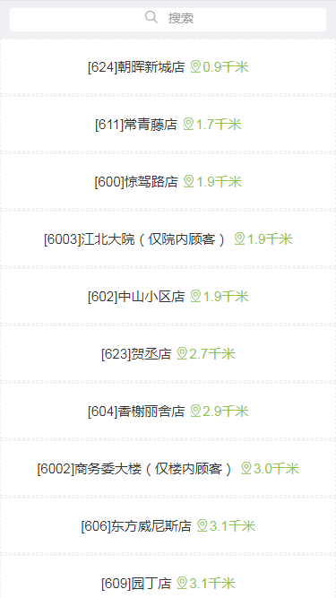
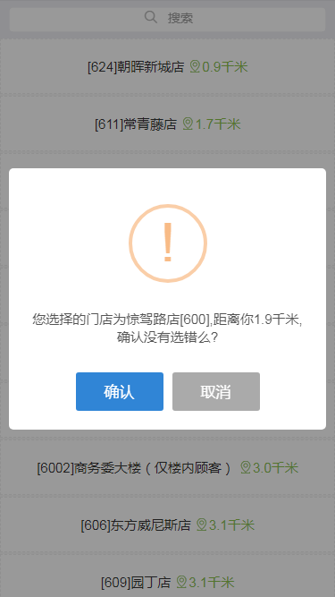
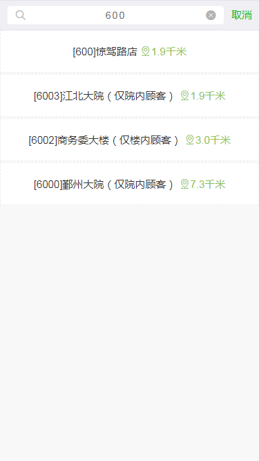
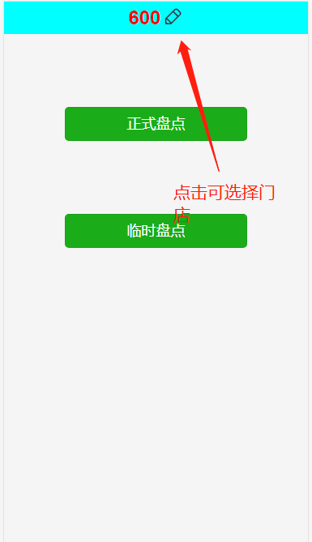

# 门店盘点操作指引

## 系统入口  

## 起始页  

## 起始页，点击进入盘点系统  

## 门店列表页

> 门店会按照距离排序,现在会对距离进行校验,操作一公里的门店会二次确认

## 通过选择门店名称和店号 来筛选门店

## 请选择相应的门店

## 可能出现的错误

### 服务器连接失败

### 门店距离过远

> 出现以上错误请按照提示操作！

## 盘点类型页

> 门店选择一次之后,就会记住,可以再类型页重新选择门店

### 选择是正式盘点或者临时盘点

## 盘点列表页

### 正式盘点:：点击直接进入

### 临时盘点：可新建

## 选择要新建的临时盘点的分类

## 盘点列表
> 1.通过筛选展示要显示的盘点列表，多页时可进行翻页；  
> 2.点击开始盘点去盘点；  
> 3.临时盘点完成时点击结束盘点结束盘点操作，正式盘点无需。  
> 4.结束状态的盘点两个按钮都不可见。  

## 盘点编辑页面

01

> 编辑盘点信息进行提交；
> 过道号及商品信息可由扫码获取；
> 点击  列表页返回。

